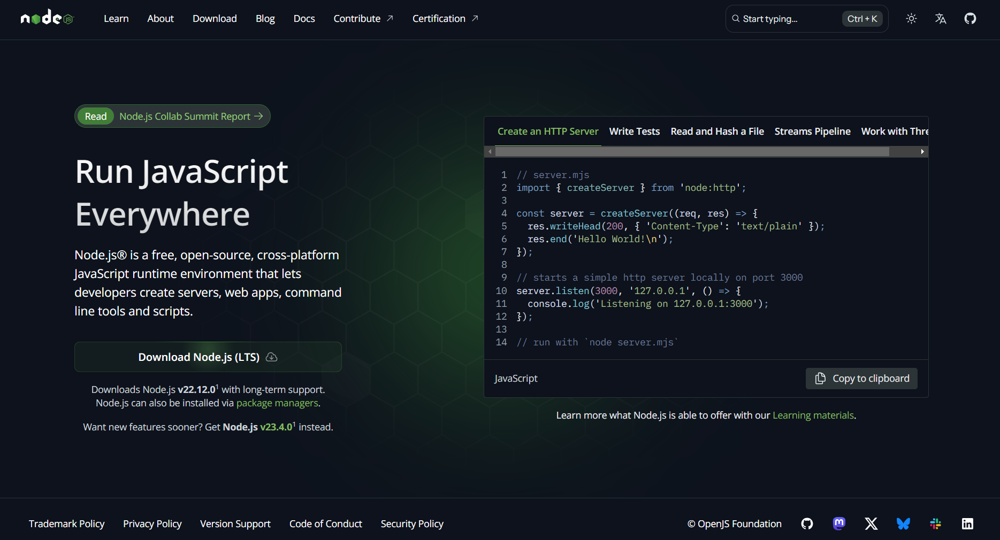
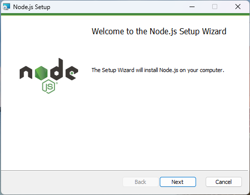

# 1. 事前準備

## 1-1 Node.js の確認

next.js をインストールするためには、Node.js(v18.18 以降)が必要となります。
次のコマンドで Node.js のバージョンを確認しましょう。

```Terminal
$ node -v
```

または

```Terminal
$ node --version
```

コマンドを実行すると次のような表示が出てくると思います。

```Terminal
v22.11.0
```

`22.11.0` の部分が `18.18.0` より大きい数字であれば大丈夫です。

もし、 Node.js がインストールされていない場合は次の手順でインストールします。


[Node.js 公式サイト](https://nodejs.org/en)

上記のサイトからインストールを進めます。



インストーラーを起動するとこのように出てくるので、指示にしたがってインストールを進めてください。
インストールが完了したら、再度インストールされているか確認してみましょう。

---

[「 2. git clone 」に進む](./clone.md)
